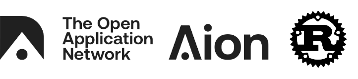

# AionR

[](https://github.com/aionnetwork/aionr/releases/latest)
[](https://gitter.im/aionnetwork)
[](https://github.com/aionnetwork/aionr/blob/dev/LICENSE)
[](https://github.com/aionnetwork/aion/issues)



This repository contains the rust kernel implementation and releases for the Aion Network. This is different from the [Java kernel implementation](https://github.com/aionnetwork/aion).

Mainstream adoption of blockchains is limited because of scalability, privacy, and interoperability challenges. Aion is a multi-tier blockchain network designed to address these challenges.

Many blockchains will are being created to solve business challenges in different industries. The Aion network is designed to support custom blockchains a provide a way for seperate blockchains to communicate. 

The [Aion White Papers](https://aion.network/developers/#whitepapers) provides more details on our design and project roadmap.

## Install the Kernel

Follow this guide to install the Aion Rust kernel on your system.

### System Requirements

- Ubuntu 16.04 or Ubuntu 18.04
- 16GB RAM
- 24GB Hard Drive Space (Mainnet DB about 12GB)

### Prerequisites Installation

1. Update your system and install the build dependencies:

    ```bash
    sudo apt-get update
    sudo apt install g++ gcc libjsoncpp-dev python-dev libudev-dev llvm-4.0-dev cmake wget curl git pkg-config lsb-release -y
    ```

2. Install Rust `v1.28.0`:

    ```bash
    curl https://sh.rustup.rs -sSf | sh -s -- --default-toolchain 1.28.0 --default-host x86_64-unknown-linux-gnu
    ```

    Select option `1` when prompted.

3. Initialize the Rust install and check that it is working:

    ```bash
    source $HOME/.cargo/env
    cargo --version

    > cargo 1.28.0 (96a2c7d16 2018-07-13)
    ```

4. Install Boost `v1.65.1`

    - Ubuntu `16.04`:

        ```bash
        wget https://dl.bintray.com/boostorg/release/1.65.1/source/boost_1_65_1.tar.bz2
        tar xf boost_1_65_1.tar.bz2
        cd boost_1_65_1
        ./bootstrap.sh --prefix=/usr/lib/x86_64-linux-gnu/
        ./b2
        ./b2 install
        ```

    - Ubuntu `18.04`:

        ```bash
        sudo apt-get install libboost-all-dev -y
        ```

5. Install ZMQ:

    ```bash
    sudo apt-get install libzmq3-dev -y
    ```

6. **This step is optional**. If you plan on modifying the _Protobuf_ message, you need to install [Google Protobuf](https://github.com/stepancheg/rust-protobuf). You will also need to make sure that `protoc` is added to your `PATH` once _Profobuf_ is installed.

### Build the Kernel

Once you have installed the prerequisites, follow these steps to build the kernel.

1. Download the Aion Rust git repository:

    ```bash
    git clone https://github.com/aionnetwork/aionr.git
    cd aionr
    ```

2. Build the kernel from source:

    ```bash
    ./scripts/package.sh aionr-package
    ```

    `aionr-package` is the name that will be given to the Rust package when it as finished building. You can set this to anything you want by changing the last argument in the script call:

    ```bash
    ./scripts/package.sh example-package-name
    ```

    The package takes about 10 minutes to finish building.

3. When the build has finished, you can find the finished binary at `package/aionr-package`.

## Launch Aion Rust Kernel

1. Navigate to the binary location:

    ```bash
    cd package/aionr-package
    ```

2. Run the `aion` package. Make sure to include any commands you want the kernel to execute. You can find more information on supplying commands in the [user manual](https://github.com/aionnetwork/aionr/wiki/User-Manual#launch-rust-kernel):

```bash
$ ./aion
> Create config file /home/aion/.aion/config.toml, you can modify it if needed
> 2019-01-23 09:12:40 Config path /home/aion/.aion/config.toml
> 2019-01-23 09:12:40 Load built-in Mainnet Genesis Spec.
> 2019-01-23 09:12:40 Keys path /home/aion/.aion/keys/mainnet
> 2019-01-23 09:12:40 DB path /home/aion/.aion/chains/mainnet/db/a98e36807c1b0211
> 2019-01-23 09:12:40 
>              _____    ____    _   _ 
>      /\     |_   _|  / __ \  | \ | |
>     /  \      | |   | |  | | |  \| |
>    / /\ \     | |   | |  | | | . ` |
>   / ____ \   _| |_  | |__| | | |\  |
>  /_/    \_\ |_____|  \____/  |_| \_|
> 
> 
> 2019-01-23 09:12:40 Starting Aion(R)/v/x86_64-linux-gnu/rustc-1.28.0
> 2019-01-23 09:12:40 Configured for Mainnet using POWEquihashEngine engine
> 2019-01-23 09:12:41 Genesis hash: 30793b4ea012c6d3a58c85c5b049962669369807a98e36807c1b02116417f823
> 2019-01-23 09:12:41 State DB configuration: archive
> 2019-01-23 09:12:41 Wallet API is disabled.
> 2019-01-23 09:12:41 local node loaded: 48859e8a-0717-4354-bd9e-447ed35f27ac@0.0.0.0:30303
> 2019-01-23 09:12:46 Listening on: 0.0.0.0:30303
> 2019-01-23 09:12:46 Local node fill back!
> 2019-01-23 09:12:46 ======================================================== Sync Statics =========================================================

```

### Connecting to JSON RPC Services

RPC services can be connected from the following addresses:

- **HTTP**: Port `8545`
- **WebSocket**: Port `8546`
- **ICP**: `$Home/.aion/jsonrpc.ipc`

See the [user manual](./wiki/User-Manual) or [CMD & Config](https://github.com/aionnetwork/aionr/wiki/CMD-&-Config) wiki to find how to change RPC port settings.

### Miners

If you're interested in mining on the Aion networks, refer to our [Aion Mining Docs](https://docs.aion.network/docs/aion-mining-overview)

### Users

If you're interested in interacting with blockchain applications and _using_ `AION` coins, refer to our [Aion Desktop Wallet Docs](https://docs.aion.network/docs/aion-desktop-wallet).

## Contact

To keep up to date by joining the following channels:

- [Aion Forum](https://forum.aion.network/)  
- [Aion Gitter](https://gitter.im/aionnetwork)  
- [Aion Reddit](https://www.reddit.com/r/AionNetwork/)  
- [Aion Medium](https://blog.aion.network/)

For more information about Aion Community please refer to [Aion Community](https://aion.network/community/)

## License

Aion is released under the [GPL-V3 license](LICENSE)
